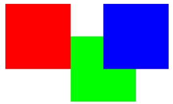
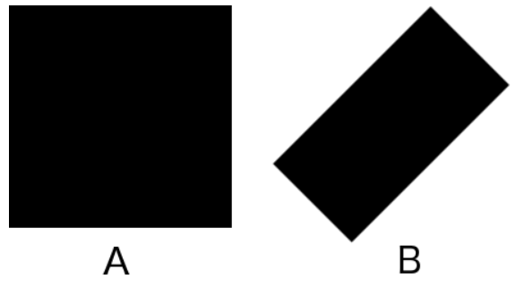

**Задание 1.** Отобразить на экране три квадрата (синего, красного и зеленого цветов ровно) так как показано на рисунке.

**Задание 2.** Поместить в центр синего квадрата из предыдущего задания текст "Квадрат" (или любой другой текст на Ваш выбор) белого цвета.

**Задание 3.** Анимировать преобразование квадрата A в прямоугольник B.
